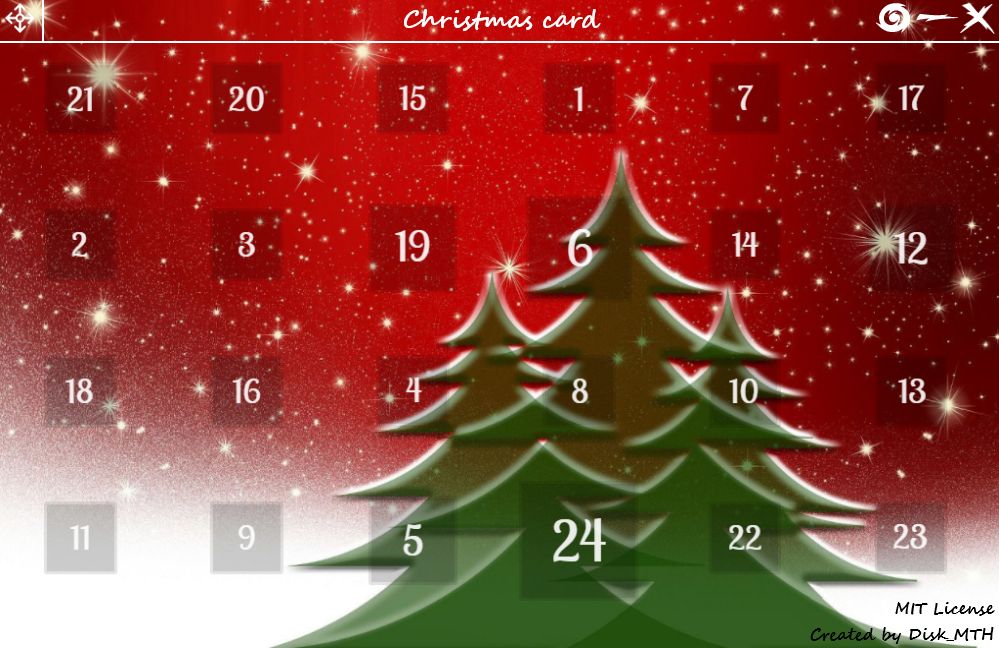

# Christmas card
This project is under development, so it is not complete. All that is indicated below is therefore not yet contractual.

## Presentation
This github repository is a project resulting from a work requested in court. The exercise was to make a little Christmas card drawn with a turtle but, the project being really simple, I decided to do things my way (while answering the basic exercise of course). In this projects I therefore use turtle for the drawing, tkinter for the GUI and (I don't know for the sound yet).

## License
All the files in this repository are completely free of rights (see the [license](https://github.com/Disk-MTH/Christmas-card/blob/master/license.txt)) so you can grab the images, the code ... and do whatever you want with them (just respect the [license](https://github.com/Disk-MTH/Christmas-card/blob/master/license.txt)).

## Informations
So that you can recover the background image, that you can modify and redistribute this project, the credits are an overlay image so you can remove it. (If you are reusing the project in any way, please cite this repository link to give me visibility for my future projects).

## Pictures
MainGUI :

Thanks for reading and good development!

Disk_MTH