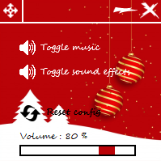

# Christmas card
This project is under development, so it is not complete. All that is indicated 
below is therefore not yet contractual. To launch the app you have just to double 
click on [start.vbs](https://github.com/Disk-MTH/Christmas-card/blob/master/start.vbs) or launch [Main.py](https://github.com/Disk-MTH/Christmas-card/blob/master/diskmth/Main.py) with python. To use this program you must 
have the Pygame library that you can install with the following command: ```pip install pygame```. If while running this command you get an error, it could come 
from the way you installed python. I will do a short tutorial on how to properly 
install python on windows soon.

## Presentation
This github repository is a project resulting from a work requested in a maths 
lesson. The exercise was to make a little Christmas card drawn with a turtle but, 
the project being really simple, I decided to do things my way (while answering 
the basic exercise of course). In this projects I therefore use turtle for the 
drawing, tkinter for the GUI, pygame for sounds, threading for concurrent 
programming, all under python 3.10.0. I have also added a settings backup 
system, so when you reopen the app after changing your settings, they will be 
kept. In addition, the configuration is self-checked so if you ever modify the file 
anyhow, or delete it the default settings will be reset. The application is also 
multi-threaded: the image, the sound and the configuration management 
system are completely independent in their operation but if the GUI thread stops 
(when you close the application), everything is stops.

## Informations
So that you can recover the background image, that you can modify and 
redistribute this project, the credits are an overlay image so you can remove it. 
(If you are reusing the project in any way, please cite this repository link to give 
me visibility for my future projects).

## Pictures
MainGUI :


ConfigGUI :



## License
All the files in this repository are completely free of rights (see the [license](https://github.com/Disk-MTH/Christmas-card/blob/master/license.txt)) so 
you can grab the images, the code ... and do whatever you want with them (just 
respect the [license](https://github.com/Disk-MTH/Christmas-card/blob/master/license.txt)).

Thanks for reading and good development!

Disk_MTH